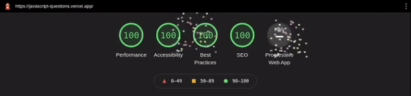

# JavaScript quiz

A small quiz application for JavaScript questions based on [Svelte](https://svelte.dev). The [questions](https://github.com/lydiahallie/javascript-questions/) have been created by [@lydiahallie](https://github.com/lydiahallie/). Thanks for sharing! 🙏

The website works completely locally. The questions come from the readme linked above and are parsed to readable objects. Optionally you can enable cookies. Then the answered questions are saved locally and you can continue playing another time.

## Website

Here is a link to the quiz: https://javascript-questions.vercel.app/ 🚀

## Run dev

Just clone the repository, run `npm i` and then start the Svelte dev server with `npm run dev`.

## Feedback

This is my first Svelte app. So feel free to give me feedback or contribute :)

## Credits

Svelte app made by [@nclskfm](https://github.com/nclskfm/). Questions made by [@lydiahallie](https://github.com/lydiahallie/).

---

🥳
